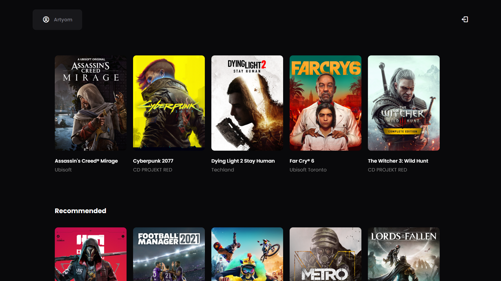

;

# Game Reviews Website

This GitHub repository contains a Node.js application that uses Express.js for routing and MongoDB for data storage. The application provides functionality for user authentication (sign-in, sign-up, and logout), viewing and adding game reviews, and deleting reviews. It uses sessions to store user information and allows users to view games and their reviews. The application is structured with separate routes for different functionalities, such as sign-in, sign-up, logout, home, and reviews.

### Highlights

* Responsive Design
* Forms
* Authentication System
* Full CRUD functionality
* Swiper.js
* CSS Grid
* Responsive navigation

### Sections

* Sign In
* Sign Up
* Home
* Reviews

# Installation

> [!IMPORTANT]
> Make sure you've already installed [Node](https://nodejs.org/en) and [Git](https://git-scm.com/) on your machine earlier.

Head into your folder and clone the repo by typing these comands in your terminal to check out the project:

```bash
git clone https://github.com/artyom250/review-app.git
cd review-app
npm install
node index
```